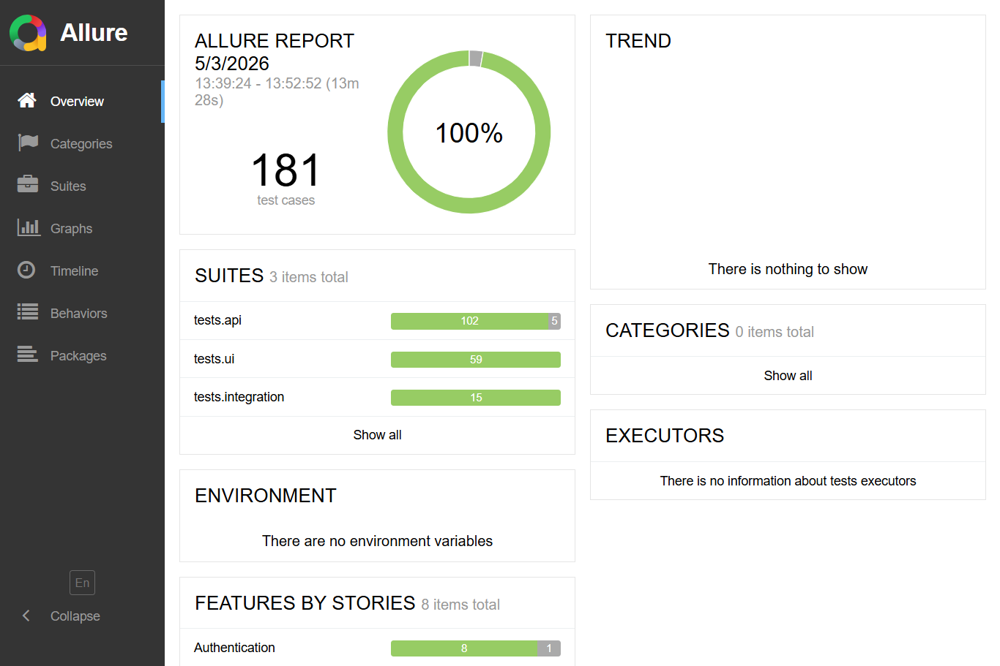
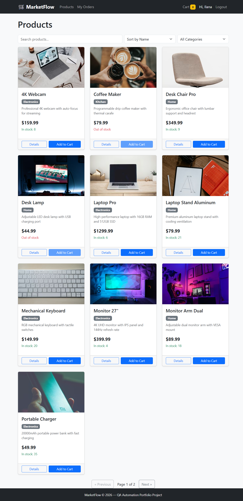

# MarketFlow QA Automation

A full-stack mini marketplace built specifically for QA Automation practice.
Demonstrates professional QA engineering skills: API testing, UI testing (Selenium + Page Object Model), integration testing, Allure reports, Swagger docs, and Postman collections.

[](https://ilanarosenberg.github.io/marketflow-qa-automation)

---

## Tech Stack

| Layer | Technology |
|-------|-----------|
| Backend | Python 3.11 · Flask · SQLAlchemy · SQLite |
| Frontend | Jinja2 templates · Bootstrap 5 |
| Auth | JWT (API) · Flask session (UI) |
| API tests | pytest · Flask test client |
| UI tests | Selenium 4 · Page Object Model |
| Reporting | Allure · pytest-cov |
| Docs | Swagger UI (flasgger) · Postman collection |

---

## Project Structure

```
MarketFlow-QA-Automation/
├── app/                        # Flask application
│   ├── auth/                   # Register, login, JWT decorator
│   ├── products/               # Product listing and detail
│   ├── cart/                   # Cart management
│   ├── orders/                 # Checkout and order history
│   ├── templates/              # Jinja2 HTML pages
│   └── static/                 # CSS · api.js · checkout-payment-validation.js
├── seed_data/                  # 2 test users + 20 seeded products
├── tests/
│   ├── conftest.py             # Shared API fixtures (in-memory DB per test) + attach_response helper
│   ├── api/                    # API tests (pytest + Flask test client)
│   │   ├── test_auth_api.py
│   │   ├── test_products_api.py
│   │   ├── test_cart_api.py
│   │   ├── test_orders_api.py
│   │   ├── test_error_cases.py
│   │   ├── test_security.py         # SQL injection, XSS, IDOR, auth bypass, data exposure
│   │   └── test_known_failures.py   # 5 xfail tests documenting real open bugs
│   ├── ui/                     # Selenium tests with Page Object Model
│   │   ├── conftest.py         # Session-scoped live server + function-scoped driver
│   │   ├── pages/              # BasePage, LoginPage, CartPage, CheckoutPage, …
│   │   ├── test_auth_ui.py
│   │   ├── test_product_ui.py
│   │   ├── test_cart_ui.py
│   │   └── test_checkout_ui.py
│   └── integration/            # Cross-layer end-to-end tests
├── docs/
│   ├── MarketFlow.postman_collection.json
│   └── MarketFlow.postman_environment.json
├── run.py                      # Dev server entry point
├── pytest.ini
└── requirements.txt
```

---

## Quick Start

### 1. Clone & install

```bash
git clone <repo-url>
cd MarketFlow-QA-Automation
pip install -r requirements.txt
```

### 2. Start the application

```bash
python run.py
```

Starts at **http://localhost:5000** and seeds the database automatically on first run.

- **Swagger UI**: http://localhost:5000/api/docs

---

## Test Credentials

| Username | Email | Password |
|----------|-------|---------|
| testuser1 | testuser1@example.com | Password123! |
| testuser2 | testuser2@example.com | Password123! |

---

## Seed Products (20 total)

| ID | Product | Category | Price | Stock |
|----|---------|----------|-------|-------|
| 1 | Laptop Pro | Electronics | $1299.99 | 10 |
| 2 | Wireless Mouse | Electronics | $29.99 | 50 |
| 3 | USB-C Cable | Electronics | $9.99 | **0** |
| 4 | Monitor 27" | Electronics | $399.99 | 5 |
| 5 | Mechanical Keyboard | Electronics | $149.99 | 20 |
| 6 | Running Shoes | Sports | $89.99 | 15 |
| 7 | Yoga Mat | Sports | $34.99 | 30 |
| 8 | Coffee Maker | Kitchen | $79.99 | **1** (low) |
| 9 | The QA Engineer Handbook | Books | $14.99 | 100 |
| 10 | Desk Lamp | Home | $44.99 | **0** |
| 11 | 4K Webcam | Electronics | $159.99 | 8 |
| 12 | Wireless Headphones | Electronics | $299.99 | 12 |
| 13 | USB Hub 7-Port | Electronics | $34.99 | 25 |
| 14 | Portable Charger | Electronics | $49.99 | 35 |
| 15 | Wireless Mouse Pad | Electronics | $59.99 | **0** |
| 16 | Standing Desk | Home | $499.99 | 6 |
| 17 | Desk Chair Pro | Home | $349.99 | 9 |
| 18 | Monitor Arm Dual | Home | $89.99 | 18 |
| 19 | Screen Protector Pack | Electronics | $19.99 | 50 |
| 20 | Laptop Stand Aluminum | Home | $79.99 | 22 |

Products 3, 10, 15 are always out-of-stock. Product 8 is the low-stock boundary.

---

## Running Tests

### API + Integration (no browser)

```bash
pytest tests/api/ tests/integration/ -v
```

### UI tests (requires Chrome — starts Flask on port 5001 automatically)

```bash
pytest tests/ui/ -v
```

### By suite marker

```bash
pytest -m smoke -v        # Critical happy-path (~5 min, run on every commit)
pytest -m sanity -v       # Core-feature suite (~15 min, run after deploy)
pytest -m regression -v   # Full suite including edge cases (pre-release)
```

### By test type

```bash
pytest -m api -v
pytest -m integration -v
pytest -m ui -v
```

### Single file or test

```bash
pytest tests/api/test_cart_api.py -v
pytest tests/api/test_cart_api.py::TestAddToCart::test_add_to_cart_success -v
```

---

## Allure Reports

Allure is fully integrated. Every test run automatically generates results in `allure-results/` (configured in `pytest.ini`). The report organises tests by **Feature** and **Story**, shows severity levels (Blocker → Minor), and surfaces open bugs as **XFAIL**.

### 1. Install Allure CLI (one-time setup)

| OS | Command |
|----|---------|
| Windows (Scoop) | `scoop install allure` |
| macOS (Homebrew) | `brew install allure` |
| Manual | Download from [allure2 releases](https://github.com/allure-framework/allure2/releases), unzip, add `bin/` to PATH |

Verify: `allure --version`

### 2. Run tests (results generated automatically)

```bash
# API + integration
pytest tests/api/ tests/integration/ -v

# UI tests
pytest tests/ui/ -v

# Everything at once
pytest -v
```

`pytest.ini` already includes `--alluredir=allure-results --clean-alluredir`, so results are refreshed on every run. No extra flags needed.

### 3. View the report

```bash
# Launch a local server and open the report in your browser
allure serve allure-results
```

Or generate a static HTML report:

```bash
allure generate allure-results -o allure-report --clean
allure open allure-report
```

### What you will see in the report

| Section | What it shows |
|---------|--------------|
| **Suites** | Tests grouped by file and class |
| **Features / Stories** | Tests grouped by `@allure.feature` / `@allure.story` (e.g. Authentication → Login) |
| **Severity** | Blocker · Critical · Normal · Minor per test |
| **Behaviors** | Full user-story traceability view |
| **XFAIL (broken)** | BUG-001 → BUG-005 — open bugs visible on the dashboard as expected failures |
| **Timeline** | Execution order and duration per test |



> `allure-results/` and `allure-report/` are in `.gitignore` and are never committed.

---

## API Endpoints

| Method | Endpoint | Auth | Description |
|--------|----------|------|-------------|
| POST | `/api/auth/register` | — | Register new user |
| POST | `/api/auth/login` | — | Login, returns JWT |
| POST | `/api/auth/logout` | JWT | Logout |
| GET | `/api/auth/me` | JWT | Current user info |
| GET | `/api/products/` | — | List / search / filter / paginate |
| GET | `/api/products/<id>` | — | Product detail |
| POST | `/api/products/` | JWT | Create product |
| GET | `/api/cart/` | JWT | View cart |
| POST | `/api/cart/add` | JWT | Add item |
| PATCH | `/api/cart/item/<id>` | JWT | Update quantity |
| DELETE | `/api/cart/item/<id>` | JWT | Remove item |
| DELETE | `/api/cart/clear` | JWT | Clear cart |
| POST | `/api/orders/checkout` | JWT | Place order (atomic) |
| GET | `/api/orders/` | JWT | Order history |
| GET | `/api/orders/<id>` | JWT | Order detail |
| POST | `/api/orders/<id>/cancel` | JWT | Cancel order |

All responses:
```json
{ "success": true, "data": { ... }, "error": null }
```

---

## Postman

1. Open Postman → Import → `docs/MarketFlow.postman_collection.json`
2. Import environment: `docs/MarketFlow.postman_environment.json`
3. Select **MarketFlow Local**
4. Run **Auth › Login** — token saved to `{{token}}` automatically
5. Run any other request — `{{token}}` and `{{order_id}}` auto-populate

---

## Known Failures (Open Bugs)

Five tests in `tests/api/test_known_failures.py` are marked `xfail(strict=True)` to document real gaps visible in the Allure report as orange XFAIL entries. Each includes the expected behaviour, actual behaviour, and business impact — the same information you would put in a real bug ticket.

| Bug ID | Severity | Description |
|--------|----------|-------------|
| BUG-001 | Normal | `?in_stock=true` filter not implemented — out-of-stock products leak through |
| BUG-002 | Normal | `?min_price` / `?max_price` range filter not implemented — all products returned |
| BUG-003 | Minor | `?sort=stock` not implemented — silently falls back to name sort |
| BUG-004 | Normal | Username has no maximum length validation — 500-char usernames accepted |
| BUG-005 | Normal | Product creation allows `price=0` — accidental free listings possible |

---

## UI Pages

| URL | Page |
|-----|------|
| `/` | Product list — search, sort, category filter, pagination |
| `/login` | Login form |
| `/register` | Registration form |
| `/products/<id>` | Product detail + Add to Cart |
| `/cart` | Shopping cart |
| `/checkout` | Multi-step checkout with payment validation |
| `/my-orders` | Order history |
| `/orders/<id>` | Order detail |

All interactive elements carry `data-testid` attributes for stable Selenium locators.


